# Spring Batch

### 1 Getting Started

##### 1.1 Batch Processing Concepts

Batch jobs follow a typical pattern. They consist of reading from a fixed data set, like our time entries. And then processing each item in the data set until it reaches the end. The processing that occurs for each item varies for each batch job and the business operation it's meant to complete. It is common to execute batch jobs on a schedule. Allowing the necessary data to accumulate over a period of time between executions. Once we have the necessary data for the period, the job is triggered to perform the processing.

<p> 
What is Batch Processing:
    <li>Behind the scenes processes</li>
    <li>Run without user interaction</li>
    <li>Executes over a fixed data set</li>
    <li>Scheduled jobs correspond with business activities</li>
</p>
<p>
Use Cases:
    <li>Reporting:</li>
        <ul>Processing large datasets to calculate and distribute information</ul>
        <ul>Often time-based (monthly bank statements, quarterly financials)</ul>
        <ul>Requires a collection of data over the period</ul>
    <li>Information Exchange</li>
        <ul>Sending/receiving of data between systems</ul>
        <ul>Integration via file exchanges, database connections, and messaging</ul>
        <ul>Applies <b>extract</b>, <b>transform</b>, and <b>load</b> (ETL) pattern</ul>
</p>

##### 1.2 Spring Batch Overview

<p>
Spring Batch is a lightweight framework for building batch applications that perform batch processing

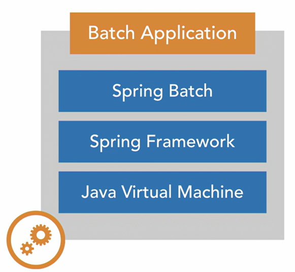
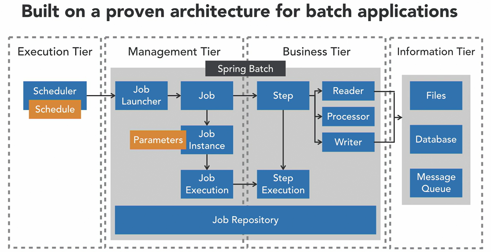

Key features
<li>State Management — the framework stores metadata regarding jobs and their executions out of the box. During execution of a job, Spring Batch writes metadata to a job repository at various points in time, we don't even need to write any code to make this happen. This is very helpful when determining what jobs have executed, why a job has failed, and is used to support additional batch functionality like restarts.</li>
<li>Restartability — the framework can restart failed jobs at the appropriate step. In the event a job does fail Spring Batch provides the capability to restart the job from where we left off based upon information about the job in the job repository. So if we execute this job and processing fails when reading the second chuck of data in step two, the entire job will be marked as failed. So we see step two marked as failed, and then our job ultimately has failed. We can then use the framework to relaunch the job. And the job will begin to execute, skipping those steps that have executed successfully and starting at our failed step, in this case step two. Step two will not process the first chunk of data, it's going to restart at the second chuck, and here we see that it completes successfully. At that point, both our step and job will be marked as successfully executed within the job repository.</li>

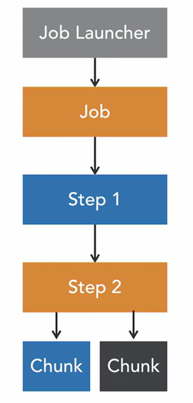

<li>Readers and Writers — the framework provides out-of-the-box components to integrate with popular data sources. Most batch jobs need to read data from some data source, do some processing, then write the process data to another data source. Spring Batch provides the item reader and item writer interfaces to abstract this concept and provides out of the box implementations for consuming or writing data to popular data sources like flat files, relational databases, XML files, JSON files, and Kafka. So the framework handles a lot of the heavy lifting when it comes to reading and writing data in a batch job. For developers using Spring Batch it's just a matter of configuring the appropriate reader, or writer for your data store.</li>

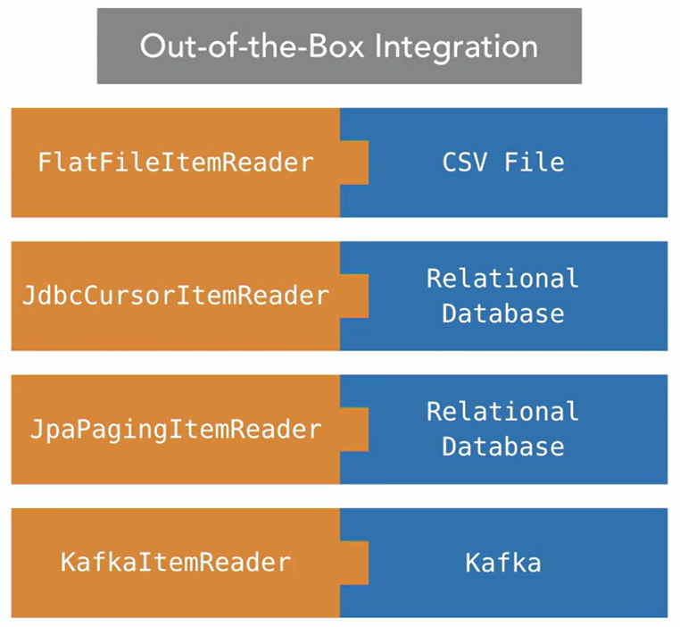

<li>Transaction Support — the framework provides transactional writers that can roll back in the event of an error. Spring Batch also provides support for transactions, primarily for the item writers found within the framework. When an item writer writes a chuck of data it occurs with in a transaction. So if the first record in the chunk is written and the second record fails, the entire chuck of data is rolled back. The architecture and features found within Spring Batch address the most common challenges developers face when building a batch job. There really isn't a good case for attempting to write your own batch application on the JVM with a custom architecture.</li>

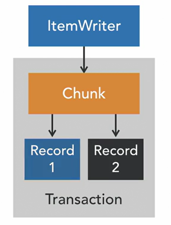

<p>Building application:</p>

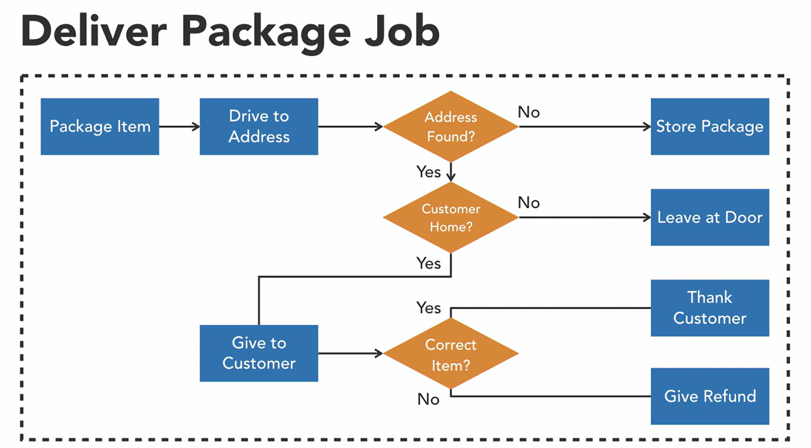

</p>

Spring Batch uses a job repository to capture metadata regarding the execution of a batch job. The job repository typically stores this metadata in a relational database that Spring Batch uses to make decisions about job executions. Whilst Spring Batch will create the table schema required to store the metadata, we'll need to supply the database where the schema can be created.

### 2 Building Batch Jobs

##### 2.1 Spring Batch Architecture

<p> 
A job represents the entire batch process that we want to execute. It defines one or more steps that execute in an order we commonly call a flow. 
A step is a phase in a batch job that defines how the actual processing will occur for that portion of the job. The processing logic within a step may read data from a data source, process it and then write it to another data source.
A job can contain multiple steps and the flow from one step to another can be dynamic. Meaning it can be conditional or occur in parallel.</br>
The entire job is launched using a JobLauncher, which may pass JobParameters to the job. 
As the job runs, metadata regarding the job is written to the job repository.  When a job launcher creates a job, it typically will pass the name of the job and some parameters. The combination of the Job Name and its parameters defines a new JobInstance which is created.
When we execute a JobInstance, we create a new JobExecution.</p>

Example: relaunch job with the same job name and JobParameters:
On the screen below it represents the same JobInstance 
But looks attention to JobExecution. For this example, it not the same JobExecution.
Because it is the second execution of a particular job instance.
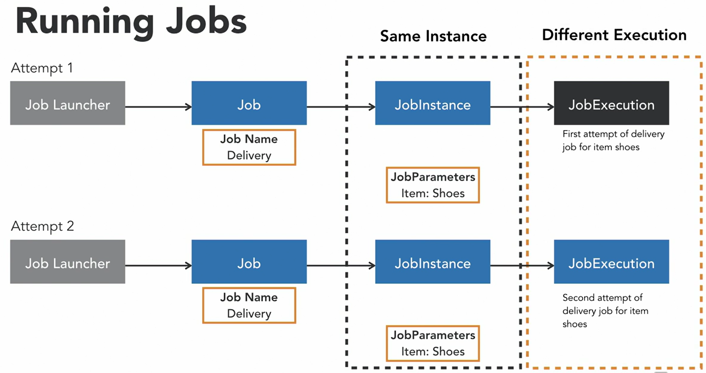

Example: Different Job Instances
Here we'll see the same job ran with different parameters, which creates a different JobInstance and a new execution of that JobInstance. So here we see in attempt three, we have the same job name but you'll notice that the JobParameter being passed is different. This means that we're going to have a different JobInstance and when that JobInstance is executed we're going to get a different JobExecution.
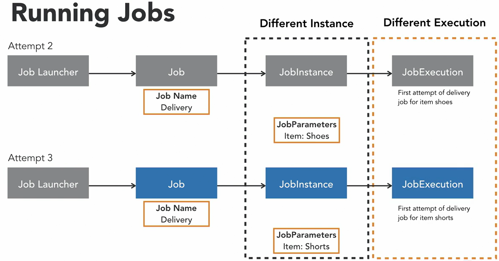

As the steps execute within a job, there's a very similar concept that is applied. So each execution of a step is going to create a new StepExecution. The StepExecution is associated with a JobExecution and its possible to have multiple StepExecutions when a failure occurs in our processing and we need to restart a job.
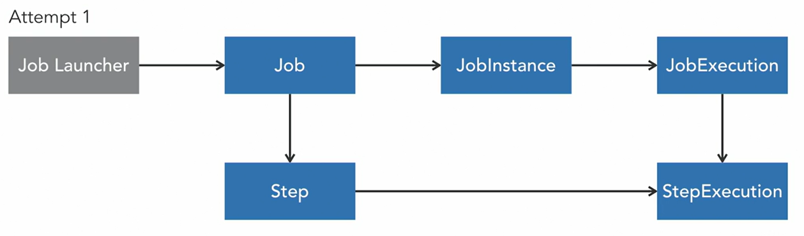
As they execute, metadata regarding JobInstance, JobExecutions and StepExecutions are all stored in the JobRepository. Here you see some of the tables the JobRepository uses to store this information in a relational database. Of particular interest is the status and exit code columns found within the execution tables. These columns hold information regarding the success or failure of a job.
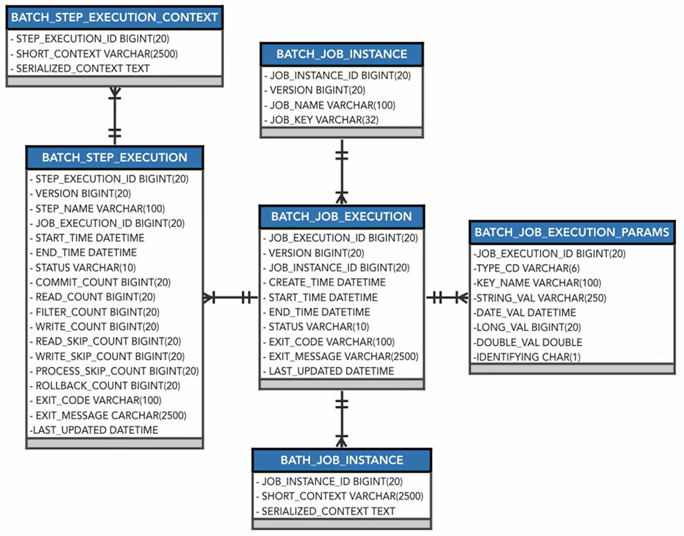

<p>The two types of steps found within Spring Batch. </p>
<li><b>Tasklet-Based Step:</b> It contains a single method on its interface named execute, that runs over and over until it gives signal to stop. Tasklets are typically used for things like setup logic, stored procedures or other custom logic that cannot be achieved without the box components.</li>
<li><b>Chunk-Based Step:</b> It is used in scenarios where we need to process data from a data source. The chunk-based step leverages the ItemReader interface to read chunks of data from a data store. Then writes the chunks in a transaction using the ItemWriter. Optionally, we can include an ItemProcessor implementation to perform transformations on the data.</li>

##### 2.2 Configuring a Job Repository
<p>
Spring batch uses the job repository to store metadata about the execution of a batch job.
</p>
<p>
Run PostgreSQL container using docker

```shell
docker run --name postgresql -e POSTGRES_USER=postgres -e POSTGRES_PASSWORD=postgres -e POSTGRES_DB=job_repository -p 5432:5432 -d postgres
```

Provide Postgres dependencies into pom.xml

```xml
<dependency>
    <groupId>org.postgresql</groupId>
    <artifactId>postgresql</artifactId>
    <scope>runtime</scope>
</dependency>
```

Provide Application Properties for Datasource:

```yaml
spring:
  datasource:
    url: jdbc:postgresql://localhost:5432/job_repository
    username: postgres
    password: postgres
    driver-class-name: org.postgresql.Driver
  jpa:
    show-sql: true
    open-in-view: false
  batch:
    jdbc:
      initialize-schema: always
      isolation-level-for-create: default
```

Check the output from the following tables:
```text
SELECT * FROM batch_job_instance;
SELECT * FROM batch_job_execution;
SELECT * FROM batch_step_execution;
```
</p>

##### 2.3 Job Parameters
<p>
Job instances are created using the name of the job and parameters passed by a job launcher. 
If a job instance has been successfully executed, <u>it's not possible to rerun that same job instance</u>. 
Instead, a new job instance must be created by passing a new job parameter to the job. 

```shell
maven clean package
```
```shell
java -jar .\target\spring-batch-demo-1.0.0.jar
```
So for example, when we've been running our job, we haven't been supplying any job parameters. 
Therefore, if we re-execute the same job, it will not be started by the framework, it will assume the job has been successfully completed, and it won't allow us to restart. 
So here you can see that it's signifying the step has already been completed, or it's not restartable. 
So if we want to relaunch this job, we need to do it with a new job parameter so that we get a new job instance. 
Here, we're also able to pass our job parameter. 
```shell
java -jar .\target\spring-batch-demo-1.0.0.jar "job_parameter_1=value" "job_parameter_2=value"
```
So if we look at our step, we're able to access job parameters by working with the chunkContext. 
So, what we're going to do is create a new string named item and then we're going to use the chunkContext and we're going to get the stepContext and then from there, we can access a map containing our job parameters. 
```java
@Bean
public Step packageItemStep() {
    return stepBuilderFactory
        .get("packageItemStep")
        .tasklet((stepContribution, chunkContext) -> {
            var item = chunkContext.getStepContext().getJobParameters().get("item").toString();
            var date = chunkContext.getStepContext().getJobParameters().get("run.date").toString();
            System.out.println(String.format("The %s has been packaged on %s.", item, date));
            return RepeatStatus.FINISHED;
        })
        .build();
}
```
So just like a typical map, we need a key.
In this case, it's the name of the job parameter. And then because the value of the map is of type object, we're going to take that object to a string in order to assign it to our items string.
And then we're going to declare a new job parameter that we're going to access.
And this is a very common job parameter, it's going to be the date that the job was ran.
```shell
java -jar .\target\spring-batch-demo-1.0.0.jar "item=shoes" "run.date(date)=2022/10/27"
```
So when we launched the job next time, we're going to specify a parameter run.date. And that's going to allow us to pass in the date the job was ran and then when we output this information within our tasklet to the console.
So we'll just need to then supply those two arguments, first, the name of the item, and then second, the date.
Now when the job executes, you'll see that we got a new job instance so we were able to, you know, rerun the job and then we were able to access the value of those job parameters. 
So job parameters are very important. When we are scheduling jobs, it's often necessary to pass in job parameters so that we're able to get that new job instance and we're able to execute the run for that particular instance of the job.
</p>

##### 2.4 Building Jobs with multiple steps
<p>
Batch jobs normally contain more than a single step.
The execution of most jobs flows sequentially from one step to another until the job completes.
When configuring a job with multiple steps, the job builder interface allows us to define <b>transitions</b> from one step to another to create a multi-step job.
</p>
See these transitions:

```java
@Bean
public Step driveToAddressStep() {
    return stepBuilderFactory
        .get("driveToAddressStep")
        .tasklet((contribution, chunkContext) -> {
            System.out.println("Successfully arrived to address.");
            return RepeatStatus.FINISHED;
        })
        .build();
}

@Bean
public Step givePackageToCustomerStep() {
    return stepBuilderFactory
        .get("givePackageToCustomerStep")
        .tasklet((contribution, chunkContext) -> {
            System.out.println("Given the package to the customer.");
            return RepeatStatus.FINISHED;
        })
        .build();
}

@Bean
public Job deliverPackageJob() {
        return jobBuilderFactory
            .get("deliverPackageJob")
            //transition one step to another step. These steps are executed in sequence.
            .start(packageItemStep())
            .next(driveToAddressStep())
            .next(givePackageToCustomerStep())
            .build();
}
```
Bat script:
```cmd
set CURRENT_DATE=%date:~10,6%%date:~6,4%%date:~4,2%
echo %CURRENT_DATE%
call mvn clean package -DskipTests
call java -jar ./target/spring-batch-demo-1.0.0.jar "item=shoes" "run.date(date)=%CURRENT_DATE%"
```

##### 2.5 Restarting Jobs
Unfortunately, not every batch job runs successfully the first time. Spring Batch allows failed jobs to be restarted. The framework only allows a job to be restarted if the overall status of a job execution is marked as `FAILED` or `STOPPED`.</br>
By default, it does not allow completed jobs to be restarted.</br>
When a job is restarted, Spring Batch will create a new `JobExecution` for the particular `JobInstance` that failed, and it will restart at the failed step, executing from that point forward.</br>
An Example: We're going to introduce some boolean logic within our drive to address step. Let's imagine that we can get lost while we are driving our package to the address for delivery. So, we'll just introduce a boolean, and we'll name that boolean `GOT_LOST = true`. 
```java
@Bean
public Step driveToAddressStep() {
    boolean GOT_LOST = true;
    return stepBuilderFactory
        .get("driveToAddressStep")
        .tasklet((contribution, chunkContext) -> {
            if (GOT_LOST) {
                throw new RuntimeException("Got lost driving to the address");
            }
            System.out.println("Successfully arrived to address.");
            return RepeatStatus.FINISHED;
        })
        .build();
}
```
And then, within the execute method of our tasklet, I'm going to add a conditional that determines if we got lost, and if so, we're going to then throw a `RuntimeException`. So we just have a way to toggle the success or failure of our drive to address step. 
```shell
.\run.bat
```
You can see that we have a stack trace, within the job itself, and that's due to the run time exception that was thrown. So we did not successfully complete our job. 
```commandline
2022-12-15 12:15:55.162  INFO 15948 --- [           main] o.s.b.a.b.JobLauncherApplicationRunner   : Running default command line with: [item=potato, run.date(date)=2022/15/12]
2022-12-15 12:15:55.409  INFO 15948 --- [           main] o.s.b.c.l.support.SimpleJobLauncher      : Job: [SimpleJob: [name=deliverPackageJob]] launched with the following parameters: [{item=potato, r
un.date=1678568400000}]
2022-12-15 12:15:55.474  INFO 15948 --- [           main] o.s.batch.core.job.SimpleStepHandler     : Executing step: [packageItemStep]
The potato has been packaged on Sun Mar 12 00:00:00 MSK 2023.
2022-12-15 12:15:55.529  INFO 15948 --- [           main] o.s.batch.core.step.AbstractStep         : Step: [packageItemStep] executed in 54ms
2022-12-15 12:15:55.567  INFO 15948 --- [           main] o.s.batch.core.job.SimpleStepHandler     : Executing step: [driveToAddressStep]
2022-12-15 12:15:55.594 ERROR 15948 --- [           main] o.s.batch.core.step.AbstractStep         : Encountered an error executing step driveToAddressStep in job deliverPackageJob

java.lang.RuntimeException: Got lost driving to the address
        at com.github.uladzimirkalesny.springbatchdemo.SpringBatchDemoApplication.lambda$driveToAddressStep$1(SpringBatchDemoApplication.java:56) ~[classes!/:1.0.0]
        at org.springframework.batch.core.step.tasklet.TaskletStep$ChunkTransactionCallback.doInTransaction(TaskletStep.java:407) ~[spring-batch-core-4.3.7.jar!/:4.3.7]
        at org.springframework.batch.core.step.tasklet.TaskletStep$ChunkTransactionCallback.doInTransaction(TaskletStep.java:331) ~[spring-batch-core-4.3.7.jar!/:4.3.7]
        at org.springframework.transaction.support.TransactionTemplate.execute(TransactionTemplate.java:140) ~[spring-tx-5.3.23.jar!/:5.3.23]
        at org.springframework.batch.core.step.tasklet.TaskletStep$2.doInChunkContext(TaskletStep.java:273) ~[spring-batch-core-4.3.7.jar!/:4.3.7]
        at org.springframework.batch.core.scope.context.StepContextRepeatCallback.doInIteration(StepContextRepeatCallback.java:82) ~[spring-batch-core-4.3.7.jar!/:4.3.7]
        at org.springframework.batch.repeat.support.RepeatTemplate.getNextResult(RepeatTemplate.java:375) ~[spring-batch-infrastructure-4.3.7.jar!/:4.3.7]
        at org.springframework.batch.repeat.support.RepeatTemplate.executeInternal(RepeatTemplate.java:215) ~[spring-batch-infrastructure-4.3.7.jar!/:4.3.7]
        at org.springframework.batch.repeat.support.RepeatTemplate.iterate(RepeatTemplate.java:145) ~[spring-batch-infrastructure-4.3.7.jar!/:4.3.7]
        at org.springframework.batch.core.step.tasklet.TaskletStep.doExecute(TaskletStep.java:258) ~[spring-batch-core-4.3.7.jar!/:4.3.7]
        at org.springframework.batch.core.step.AbstractStep.execute(AbstractStep.java:208) ~[spring-batch-core-4.3.7.jar!/:4.3.7]
        at org.springframework.batch.core.job.SimpleStepHandler.handleStep(SimpleStepHandler.java:152) ~[spring-batch-core-4.3.7.jar!/:4.3.7]
        at org.springframework.batch.core.job.AbstractJob.handleStep(AbstractJob.java:413) ~[spring-batch-core-4.3.7.jar!/:4.3.7]
        at org.springframework.batch.core.job.SimpleJob.doExecute(SimpleJob.java:136) ~[spring-batch-core-4.3.7.jar!/:4.3.7]
        at org.springframework.batch.core.job.AbstractJob.execute(AbstractJob.java:320) ~[spring-batch-core-4.3.7.jar!/:4.3.7]
        at org.springframework.batch.core.launch.support.SimpleJobLauncher$1.run(SimpleJobLauncher.java:149) ~[spring-batch-core-4.3.7.jar!/:4.3.7]
        at org.springframework.core.task.SyncTaskExecutor.execute(SyncTaskExecutor.java:50) ~[spring-core-5.3.23.jar!/:5.3.23]
        at org.springframework.batch.core.launch.support.SimpleJobLauncher.run(SimpleJobLauncher.java:140) ~[spring-batch-core-4.3.7.jar!/:4.3.7]
        at java.base/jdk.internal.reflect.NativeMethodAccessorImpl.invoke0(Native Method) ~[na:na]
        at java.base/jdk.internal.reflect.NativeMethodAccessorImpl.invoke(NativeMethodAccessorImpl.java:77) ~[na:na]
        at java.base/jdk.internal.reflect.DelegatingMethodAccessorImpl.invoke(DelegatingMethodAccessorImpl.java:43) ~[na:na]
        at java.base/java.lang.reflect.Method.invoke(Method.java:568) ~[na:na]
        at org.springframework.aop.support.AopUtils.invokeJoinpointUsingReflection(AopUtils.java:344) ~[spring-aop-5.3.23.jar!/:5.3.23]
        at org.springframework.aop.framework.ReflectiveMethodInvocation.invokeJoinpoint(ReflectiveMethodInvocation.java:198) ~[spring-aop-5.3.23.jar!/:5.3.23]
        at org.springframework.aop.framework.ReflectiveMethodInvocation.proceed(ReflectiveMethodInvocation.java:163) ~[spring-aop-5.3.23.jar!/:5.3.23]
        at org.springframework.batch.core.configuration.annotation.SimpleBatchConfiguration$PassthruAdvice.invoke(SimpleBatchConfiguration.java:128) ~[spring-batch-core-4.3.7.jar!/:4.3.7]
        at org.springframework.aop.framework.ReflectiveMethodInvocation.proceed(ReflectiveMethodInvocation.java:186) ~[spring-aop-5.3.23.jar!/:5.3.23]
        at org.springframework.aop.framework.JdkDynamicAopProxy.invoke(JdkDynamicAopProxy.java:215) ~[spring-aop-5.3.23.jar!/:5.3.23]
        at jdk.proxy2/jdk.proxy2.$Proxy69.run(Unknown Source) ~[na:na]
        at org.springframework.boot.autoconfigure.batch.JobLauncherApplicationRunner.execute(JobLauncherApplicationRunner.java:199) ~[spring-boot-autoconfigure-2.7.5.jar!/:2.7.5]
        at org.springframework.boot.autoconfigure.batch.JobLauncherApplicationRunner.executeLocalJobs(JobLauncherApplicationRunner.java:173) ~[spring-boot-autoconfigure-2.7.5.jar!/:2.7.5]
        at org.springframework.boot.autoconfigure.batch.JobLauncherApplicationRunner.launchJobFromProperties(JobLauncherApplicationRunner.java:160) ~[spring-boot-autoconfigure-2.7.5.jar!/:2.7.5]      
        at org.springframework.boot.autoconfigure.batch.JobLauncherApplicationRunner.run(JobLauncherApplicationRunner.java:155) ~[spring-boot-autoconfigure-2.7.5.jar!/:2.7.5]
        at org.springframework.boot.autoconfigure.batch.JobLauncherApplicationRunner.run(JobLauncherApplicationRunner.java:150) ~[spring-boot-autoconfigure-2.7.5.jar!/:2.7.5]
        at org.springframework.boot.SpringApplication.callRunner(SpringApplication.java:762) ~[spring-boot-2.7.5.jar!/:2.7.5]
        at org.springframework.boot.SpringApplication.callRunners(SpringApplication.java:752) ~[spring-boot-2.7.5.jar!/:2.7.5]
        at org.springframework.boot.SpringApplication.run(SpringApplication.java:315) ~[spring-boot-2.7.5.jar!/:2.7.5]
        at org.springframework.boot.SpringApplication.run(SpringApplication.java:1306) ~[spring-boot-2.7.5.jar!/:2.7.5]
        at org.springframework.boot.SpringApplication.run(SpringApplication.java:1295) ~[spring-boot-2.7.5.jar!/:2.7.5]
        at com.github.uladzimirkalesny.springbatchdemo.SpringBatchDemoApplication.main(SpringBatchDemoApplication.java:87) ~[classes!/:1.0.0]
        at java.base/jdk.internal.reflect.NativeMethodAccessorImpl.invoke0(Native Method) ~[na:na]
        at java.base/jdk.internal.reflect.NativeMethodAccessorImpl.invoke(NativeMethodAccessorImpl.java:77) ~[na:na]
        at java.base/jdk.internal.reflect.DelegatingMethodAccessorImpl.invoke(DelegatingMethodAccessorImpl.java:43) ~[na:na]
        at java.base/java.lang.reflect.Method.invoke(Method.java:568) ~[na:na]
        at org.springframework.boot.loader.MainMethodRunner.run(MainMethodRunner.java:49) ~[spring-batch-demo-1.0.0.jar:1.0.0]
        at org.springframework.boot.loader.Launcher.launch(Launcher.java:108) ~[spring-batch-demo-1.0.0.jar:1.0.0]
        at org.springframework.boot.loader.Launcher.launch(Launcher.java:58) ~[spring-batch-demo-1.0.0.jar:1.0.0]
        at org.springframework.boot.loader.JarLauncher.main(JarLauncher.java:65) ~[spring-batch-demo-1.0.0.jar:1.0.0]

2022-12-15 12:15:55.618  INFO 15948 --- [           main] o.s.batch.core.step.AbstractStep         : Step: [driveToAddressStep] executed in 50ms
2022-12-15 12:15:55.650  INFO 15948 --- [           main] o.s.b.c.l.support.SimpleJobLauncher      : Job: [SimpleJob: [name=deliverPackageJob]] completed with the following parameters: [{item=potato, 
run.date=1678568400000}] and the following status: [FAILED] in 203ms
```
And if we navigate over to our job repository, we can query the job repository to see some information about what exactly happened. You can see that we have one job instance, we attempted one execution of that job instance, and it did fail.
```sql
SELECT * FROM batch_job_instance;
```
```
job_instance_id     version     job_name            job_key
4                   0           deliverPackageJob   a21ea2caf15ef34a0329b12585445dc9
```
```sql
SELECT * FROM batch_job_execution;
```
```
job_execution_id    version     job_instance_id     create_time                 start_time                  end_time                    status  exit_code   exit_message                                                    last_updated                job_configuration_location
4                   2           4                   2022-12-15 12:15:55.336000  2022-12-15 12:15:55.436000  2022-12-15 12:15:55.639000  FAILED  FAILED      java.lang.RuntimeException: Got lost driving to the address...  2022-12-15 12:15:55.639000  null
```
```sql
SELECT * FROM batch_step_execution;
```
```
step_execution_id   version     step_name           job_execution_id    start_time                  end_time                    status      commit_count  rollback_count  ...   exit_code   exit_message                                                    last_updated
8                   3           packageItemStep     4                   2022-12-15 12:15:55.475000  2022-12-15 12:15:55.529000  COMPLETED   1             0                     COMPLETED   ""                                                              2022-12-15 12:15:55.530000
9                   2           driveToAddressStep  4                   2022-12-15 12:15:55.568000  2022-12-15 12:15:55.618000  FAILED      0             1                     FAILED      java.lang.RuntimeException: Got lost driving to the address...  2022-12-15 12:15:55.619000
```
And then when we take a look at the step execution, you can see that we successfully packaged the item, but we failed in driving to the address.</br> 
And this time, we're just going to toggle the `GOT_LOST = false`, that way we succeed. So this is going to be the second run of this job instance, and then we can run the job again. So this time, it's going to be successful, as you see we're not going to execute the package items step again, because it successfully completed.
```sql
2022-12-15 13:46:20.988  INFO 33012 --- [           main] o.s.b.c.l.support.SimpleJobLauncher      : Job: [SimpleJob: [name=deliverPackageJob]] launched with the following parameters: [{item=potato, r
un.date=1678568400000}]
2022-12-15 13:46:21.050  INFO 33012 --- [           main] o.s.batch.core.job.SimpleStepHandler     : Step already complete or not restartable, so no action to execute: StepExecution: id=8, version=3, 
name=packageItemStep, status=COMPLETED, exitStatus=COMPLETED, readCount=0, filterCount=0, writeCount=0 readSkipCount=0, writeSkipCount=0, processSkipCount=0, commitCount=1, rollbackCount=0, exitDescri
ption=
2022-12-15 13:46:21.078  INFO 33012 --- [           main] o.s.batch.core.job.SimpleStepHandler     : Executing step: [driveToAddressStep]
Successfully arrived to address.
2022-12-15 13:46:21.126  INFO 33012 --- [           main] o.s.batch.core.step.AbstractStep         : Step: [driveToAddressStep] executed in 47ms
2022-12-15 13:46:21.163  INFO 33012 --- [           main] o.s.batch.core.job.SimpleStepHandler     : Executing step: [givePackageToCustomerStep]
Given the package to the customer.
2022-12-15 13:46:21.202  INFO 33012 --- [           main] o.s.batch.core.step.AbstractStep         : Step: [givePackageToCustomerStep] executed in 39ms
2022-12-15 13:46:21.241  INFO 33012 --- [           main] o.s.b.c.l.support.SimpleJobLauncher      : Job: [SimpleJob: [name=deliverPackageJob]] completed with the following parameters: [{item=potato, 
run.date=1678568400000}] and the following status: [COMPLETED] in 208ms

```
From the output to the console you can see that it's not going to execute the package item step, but we do execute the drive to address step, because it previously had failed, and when we relaunch the job, we would like to complete it successfully.</br>
From job repository, we can go ahead and query the database, and you'll now see that we still only have one job instance, because we used the same parameters.
```sql
SELECT * FROM batch_job_instance;
```
```
job_instance_id     version     job_name            job_key
4                   0           deliverPackageJob   a21ea2caf15ef34a0329b12585445dc9
```
We have a second job execution, and that job execution completed successfully.
```sql
SELECT * FROM batch_job_execution;
```
```
job_execution_id    version     job_instance_id     create_time                 start_time                  end_time                    status      exit_code   exit_message                                                    last_updated                job_configuration_location
4                   2           4                   2022-12-15 12:15:55.336000  2022-12-15 12:15:55.436000  2022-12-15 12:15:55.639000  FAILED      FAILED      java.lang.RuntimeException: Got lost driving to the address...  2022-12-15 12:15:55.639000  null
5                   2           4                   2022-12-15 13:46:20.955000  2022-12-15 13:46:21.020000  2022-12-15 13:46:21.228000  COMPLETED   COMPLETED   ""                                                              2022-12-15 13:46:21.228000  null
```
Then take a look at our step execution, see for the second job execution, we executed the drive to address step and the give package to customer step. Both of those steps completed successfully.
```sql
SELECT * FROM batch_step_execution;
```
```
step_execution_id   version     step_name                   job_execution_id    start_time                  end_time                    status      commit_count  rollback_count  ...   exit_code   exit_message                                                    last_updated
8                   3           packageItemStep             4                   2022-12-15 12:15:55.475000  2022-12-15 12:15:55.529000  COMPLETED   1             0                     COMPLETED   ""                                                              2022-12-15 12:15:55.530000
9                   2           driveToAddressStep          4                   2022-12-15 12:15:55.568000  2022-12-15 12:15:55.618000  FAILED      0             1                     FAILED      java.lang.RuntimeException: Got lost driving to the address...  2022-12-15 12:15:55.619000
10                  3           driveToAddressStep          5                   2022-12-15 13:46:21.079000  2022-12-15 13:46:21.126000  COMPLETED   1             0                     COMPLETED   ""                                                              2022-12-15 13:46:21.127000
11                  3           givePackageToCustomerStep   5                   2022-12-15 13:46:21.163000  2022-12-15 13:46:21.202000  COMPLETED   1             0                     COMPLETED   ""                                                              2022-12-15 13:46:21.204000
```
It is important to understand that jobs and steps have specific statuses that are assigned based upon the results of a job execution.</br>
Steps have an exit status that affects the overall batch status. These statuses ultimately decide if a job can be restarted, and where the job is restarted from.
##### 2.5 Jobs Flow
The majority of the work required to create a spring batch job, is defining how jobs move from one step to another step.</br> 
This concept is known as <b>flow</b>, and it is important to understand in order to address batch processing requirements.</br>
In simple jobs, execution flows sequentially from one step to another, as we have seen so far in our delivery job.</br>

We simply execute one step then the next step, repeating this pattern until the job completes. <b>Sequential execution</b> is achieved using the <b>next</b> transition within our job configuration. This transition allows us to specify the next step to execute upon the successful completion of a step.</br>
More complex jobs may require a <b>conditional</b> flow where the flow of the job may execute a different step, depending upon the result of a previous step.

Here we see a segment of a job that is configured to execute Step3 ,if Step1 is successful.</br>
If Step1 is not successful, we'll execute Step2.</br>
To support this, Spring Batch provides the transitions <b><i>on</i></b>, <b><i>to</i></b>, and <b><i>from</i></b>.</br>
These transitions can be used to conditionally define the flow from one step to another.</br>
The most <b>important</b> of these is the <b>on</b> transition, it allows us to specify a pattern that if matched by the exit status of a step, will cause the job execution to proceed to the next step specified within the step configuration.</br>
On example above after Step1, we sue the on method to check the pattern of the exit status and see if it matches `failed`. If it does, we move to Step2, otherwise, we'll go from Step1, take the exit status, and compare it to the special pattern, asterisks. This pattern basically is a catch-all, so anything aside from failed will cause our job to move to Step3. So as we watch this job execute, we see Step1 is successful, and because Step1 is successful, that will cause us to match the asterisks pattern specified in the on transition. And that means that Step3 will be executed next.</br>
If we look at the inverse, let's say Step1 were to fail, that's going to cause our job flow to transition to Step2, because we're going to return `failed` as an exit status, and then that will cause JobExecution to proceed to Step2.</br> 
So it's all about that pattern specified in the on transition and then the next step specified in the to following on. 
The statuses are very important. When a batch job executes, Spring Batch captures `two statuses for the JobExecution and the StepExecution`.</br>
The statuses are slightly similar and the differences between them is a little confusing.</br>

The first status is the `Batch Status`. This status represents the overall status for the job or step execution. It is limited to an enumerated set of values.</br>
`Batch Statuses` are fixed, they're specified in an enum, so the ones you see on the left are a fixed set of values and we cannot specify a custom BatchStatus. List of BatchStatuses: `ABANDONED, COMPLETED, FAILED, STARTED, STOPPED.`</br>
The second status is the `Exit Status` and when we're talking about conditional job flow, this is the important one. It represents a literal status that is returned from a JobExecution or a StepExecution. The Exit Status is the one that is used by our on transition for the pattern match. So when performing a conditional flow, the Exit Status will be consulted for that pattern match, which will ultimately determine the flow the job will take. 
The Exit Status, on the other hand, uses literal values and we can define our own custom ExitStatuses. This will be important when we look at conditional flows moving forward. List of ExitStatuses: `COMPLETED, EXECUTING, FAILED, STOPPED`, <b>Custom Status</b>

##### Controlling flow with custom statuses[JobExecutionDecider]
```shell
git checkout 2.8-controlling-flow-with-custom-status
```
The JobExecution decider is registered within the Job configuration and is used to provide a custom ExitStatus following the execution of a step.</br>
When more granular control over the conditional flow of the batch job is required developers can implement a `JobExecutionDecider`.</br>
`JobExecutionDecider` provides better of the job flow by ExitStatus of the Step to be modified into a Custom Exit Status.</br>
It's very useful when standard Exit Statuses not suffice.</br>
Custom Status is required to determine where the job flow should proceed.
JobExecutionDecider helps us to determine when this step needs to be executed. (for example, customer not at home)
```java
public class DeliveryDecider implements JobExecutionDecider {
    @Override
    public FlowExecutionStatus decide(JobExecution jobExecution, StepExecution stepExecution) {
        var result = LocalDateTime.now().getHour() < 12 ? "PRESENT" : "NOT_PRESENT";
        System.out.println("Decider result is: " + result);
        return new FlowExecutionStatus(result);
    }
}
```
```java
@Bean 
public JobExecutionDecider decider() {
    return new DeliveryDecider();
}
```
```java
@Bean
public Job deliverPackageJob() {
    return jobBuilderFactory
        .get("deliverPackageJob")
        .start(packageItemStep())
        // conditional flow
        .next(driveToAddressStep())
            .on("FAILED") // equals statement
            .to(storePackageStep()) // then statement
        .from(driveToAddressStep())
            .on("*").to(decider())
                .on("PRESENT").to(givePackageToCustomerStep())
            .from(decider())
                .on("NOT_PRESENT").to(leaveAtDoorStep())
        .end()
        .build();
}
```
##### 2.9 Challenge creating a conditional flow
```shell
git checkout 2.9-challenge-creating-a-conditional-flow
```
Code example
```java
@Bean
public Job deliverPackageJob() {
    return jobBuilderFactory
        .get("deliverPackageJob")
        .start(packageItemStep())
        // conditional flow
        .next(driveToAddressStep())
            .on("FAILED") // equals statement
            .to(storePackageStep()) // then statement
        .from(driveToAddressStep())
            .on("*").to(decider())
                .on("PRESENT").to(givePackageToCustomerStep())
                    .next(receiptDecider())
                        .on("CORRECT")
                        .to(thankCustomerStep())
                    .from(receiptDecider())
                        .on("INCORRECT")
                        .to(refundStep())
            .from(decider())
                .on("NOT_PRESENT").to(leaveAtDoorStep())
        .end()
        .build();
}
```
### 3 Advanced Job Flows
```shell
git checkout 3.0-advanced-job-flows
```
The batch status assigned to a job or step is important because it is used by the framework to determine if a job succeeded or failed, which ultimately, determines if a job can be restarted.</br>
Job flows are not always simple and sometimes we need control over the batch status assigned to a job.</br>
To handle this, Spring Batch provides three transitions to stop a job, and override the default batch status.</br>
These transition elements are `end`, `fail` and `stop`.</br>
By default, the batch status of a job is marked as `completed` if the exit status of its steps does not return `failed` and no transitions are specified.</br>
When transitions such as `on` are present, it gets a little bit more complicated. In some scenarios, a step can fail but due to an `on` transition, the batch status of the job is marked as `completed`.</br>
When we want to alter this behavior, we use one of the stop transitions. If we take a look at our job configuration, you'll see that we have already used the `end` stop transition.
```java
@Bean
public Job deliverPackageJob() {
    return jobBuilderFactory
        .get("deliverPackageJob")
        .start(packageItemStep())
        .next(driveToAddressStep())
            .on("FAILED") // equals statement
            .to(storePackageStep()) // then statement
        .from(driveToAddressStep())
            .on("*").to(decider())
                .on("PRESENT").to(givePackageToCustomerStep())
                    .next(receiptDecider())
                        .on("CORRECT")
                        .to(thankCustomerStep())
                    .from(receiptDecider())
                        .on("INCORRECT")
                        .to(refundStep())
            .from(decider())
                .on("NOT_PRESENT").to(leaveAtDoorStep())
        .end()
        .build();
}
```
Configure our job to fail:
<ul>
    <li>go to driveToAddressStep and change our boolean variable to true</li>

```java
    @Bean
    public Step driveToAddressStep() {
        boolean GOT_LOST = true;
        return stepBuilderFactory
                .get("driveToAddressStep")
                .tasklet((contribution, chunkContext) -> {
                    if (GOT_LOST) {
                        throw new RuntimeException("Got lost driving to the address");
                    }
                    System.out.println("Successfully arrived to address.");
                    return RepeatStatus.FINISHED;
                })
                .build();
    }
```
`boolean GOT_LOST = true;`
    <li>our job's going to fail but because we have configured our job to use the end stop transition, it's going to be marked as completed</li>
    <li>run our job and we'll see that we'll receive the exception, because boolean GOT_LOST = true; [java.lang.RuntimeException: Got lost driving to the address]</li>
    <li>look at the metadata stored regarding the job, batch status is successful, look to batch job execution, we're going to see that it was completed and then look at the step executions and see that our driveToAddressStep was abandoned.</li>
So that's not what we want to happen. In this case, we would never be able to deliver our package.
</ul>

That last status was not ideal so let's take a look at another status named `stop`.</br>
`Stop` is going to allow us to pause the job and then we can fix whatever the problem is and rerun it at a later time.</br>
```java
 @Bean
public Job deliverPackageJob() {
    return jobBuilderFactory
        .get("deliverPackageJob")
        .start(packageItemStep())
        .next(driveToAddressStep())
            .on("FAILED")
            .stop()
        .from(driveToAddressStep())
            .on("*").to(decider())
                .on("PRESENT").to(givePackageToCustomerStep())
                    .next(receiptDecider())
                        .on("CORRECT")
                        .to(thankCustomerStep())
                    .from(receiptDecider())
                        .on("INCORRECT")
                        .to(refundStep())
            .from(decider())
                .on("NOT_PRESENT").to(leaveAtDoorStep())
        .end()
        .build();
}
```
And in this case, we're just going to pause the job and allow for it to be manually fixed by a batch job operator and then we can rerun it.</br> 
This time, the job is going to pause. So we'll see the exception thrown. There's our exception but you'll notice that it's in the stopped status.</br>
Going to allow us to go back and we'll just head into our class and we're going to go to the driveToAddressStep and we're just going to manually fix the job `boolean GOT_LOST = false;`. 
Typically this would be changing some data or figuring out what the problem was and resolving it.</br>
Run the job again. You'll notice this time, we're able to actually restart the job and it can successfully process.</br>
So there we were able to successfully complete the driveToAddressStep and then we went through the remaining flow of the job.</br>
Go to take a look at an additional status that we can use and that's the failed status. 
```boolean GOT_LOST = true;```
And then if we navigate to the configuration of the job, instead of `stopping`, we're just going to go ahead and `fail`.</br>
Rerun the job. 
```java
@Bean
public Job deliverPackageJob() {
    return jobBuilderFactory
        .get("deliverPackageJob")
        .start(packageItemStep())
        .next(driveToAddressStep())
            .on("FAILED")
         //   .stop()
            .fail()
        .from(driveToAddressStep())
            .on("*").to(decider())
                .on("PRESENT").to(givePackageToCustomerStep())
                    .next(receiptDecider())
                        .on("CORRECT").to(thankCustomerStep())
                    .from(receiptDecider())
                        .on("INCORRECT").to(refundStep())
            .from(decider())
                .on("NOT_PRESENT").to(leaveAtDoorStep())
        .end()
        .build();
}
```
This time, the job will fail, which is much better than being marked as `completed`. We're explicitly marking the job as `failed`.</br>
So there you see that the status of the job is `failed`. So here we can see that our driveToAddressStep did fail and if we take a look at the status for the job execution, it's failed as well.</br>
Now, with that, we can go ahead and within our application, we can resolve the problem `boolean GOT_LOST = false;`.</br>
That's going to allow the job to succeed after rerun the job.</br>
So using the different stop transitions, and the corresponding methods in the Java configuration, we're able to get better control over the batch status of our job. And that's important because these transitions can put our job in a state that allows us to rerun it. We need to be extra careful when we're using the on transition that we don't place a job into a state because of it's batch status that will not allow us to recover from an error.

###### 3.2 Listeners - Extending batch processing
<b>Listeners</b> provide hooks into the flow of a job at various points that allow you to introduce additional batch processing logic for complex use cases.</br>
There are many listener interfaces within the framework at the job, step, chunk, and item levels of the domain.</br>
Listener implementations are created by implementing an interface, or adding annotations to a POJO, then registering the listener at the appropriate configuration level.</br>
Registered listeners are notified by the framework at key points.</br>
For example, AfterStep completion.</br>
Once notified, job processing logic found in the listener is invoked to perform its particular logic at the appropriate point in the batch execution flow.</br>
So let's say you need to introduce some header information to a file created within a job. After the step writes the file, you may introduce a listener to add the header information once the step is executed.</br> 
Here is a list of the available listeners: `JobExecutionListener, StepExecutionListener, ChunkListener, SkipListener, ItemReadListener, ItemWriteListener, ItemProcessListener, RetryListener` within the framework that can be applied at various levels of the framework according to your requirements.</br>
You can see that a listener exists for almost every object within the batch domain, allowing logic to be introduced typically before and after these components execute. Soon, we'll be working with a step execution listener that allows us to interject logic before or after a step executes.</br>

The step execution listener interface defines a `beforeStep` method that is invoked prior to step execution and an `afterStep` method that is invoked once the step has been completed.

##### 3.3 StepExecutionListener
```shell
git checkout 3.3-step-execution-listener
```
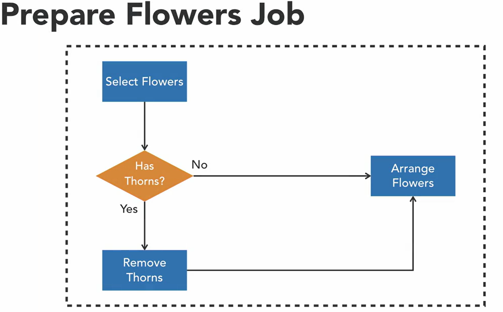
The StepExecutionListener that we'll be creating is going to determine whether or not the flowers have thorns so that we can appropriately proceed to the next step. 
```java
public class FlowersSelectionStepExecutionListener implements StepExecutionListener {
    @Override
    public void beforeStep(StepExecution stepExecution) {
        System.out.println("Executing before step logic");
    }

    @Override
    public ExitStatus afterStep(StepExecution stepExecution) {
        System.out.println("Executing after step logic");
        var flowerType = stepExecution.getJobParameters().getString("type");
        return "roses".equalsIgnoreCase(flowerType)
                ? new ExitStatus("TRIM_REQUIRED")
                : new ExitStatus("NO_TRIM_REQUIRED");
    }
}
```
RemoveThornsStep that we're going to conditionally invoke pending the results of the status provided by our StepExecutionListener.
```java
@Bean
public Step selectFlowersStep() {
    return stepBuilderFactory.get("selectFlowersStep")
        .tasklet((contribution, chunkContext) -> {
            System.out.println("Gathering flowers for order");
            return RepeatStatus.FINISHED;
        })
        .listener(selectFlowersListener())
        .build();
}
    
@Bean
public Step removeThornsStep() {
    return stepBuilderFactory.get("removeThornsStep")
        .tasklet((contribution, chunkContext) -> {
            System.out.println("Remove thorns from roses");
            return RepeatStatus.FINISHED;
        }).build();
}

@Bean
public Step arrangeFlowersStep() {
    return stepBuilderFactory.get("arrangeFlowersStep")
        .tasklet((contribution, chunkContext) -> {
            System.out.println("Arranging flowers to order");
            return RepeatStatus.FINISHED;
        }).build();
}

@Bean
public StepExecutionListener selectFlowersListener() {
    return new FlowersSelectionStepExecutionListener();
}

@Bean
public Job prepareFlowersJob() {
    return jobBuilderFactory.get("prepareFlowersJob")
        .start(selectFlowersStep())
            .on("TRIM_REQUIRED")
            .to(removeThornsStep())
            .next(arrangeFlowersStep())
        .from(selectFlowersStep())
            .on("NO_TRIM_REQUIRED")
            .to(arrangeFlowersStep())
        .end()
        .build();
}
```
Run run_flowers.bat:
```shell
call mvn clean package -DskipTests
call java -jar "-Dspring.batch.job.names=prepareFlowersJob" ./target/spring-batch-demo-1.0.0.jar "type=roses"
```
Console output:
```2022-12-16 00:24:08.970  INFO 29316 --- [           main] o.s.b.c.l.support.SimpleJobLauncher      : Job: [FlowJob: [name=prepareFlowersJob]] launched with the following parameters: [{type=roses}]
2022-12-16 00:24:09.054  INFO 29316 --- [           main] o.s.batch.core.job.SimpleStepHandler     : Executing step: [selectFlowersStep]
Executing before step logic
Gathering flowers for order
Executing after step logic
2022-12-16 00:24:09.104  INFO 29316 --- [           main] o.s.batch.core.step.AbstractStep         : Step: [selectFlowersStep] executed in 50ms
2022-12-16 00:24:09.140  INFO 29316 --- [           main] o.s.batch.core.job.SimpleStepHandler     : Executing step: [removeThornsStep]
Remove thorns from roses
2022-12-16 00:24:09.170  INFO 29316 --- [           main] o.s.batch.core.step.AbstractStep         : Step: [removeThornsStep] executed in 30ms
2022-12-16 00:24:09.199  INFO 29316 --- [           main] o.s.batch.core.job.SimpleStepHandler     : Executing step: [arrangeFlowersStep]
Arranging flowers to order
2022-12-16 00:24:09.225  INFO 29316 --- [           main] o.s.batch.core.step.AbstractStep         : Step: [arrangeFlowersStep] executed in 26ms
2022-12-16 00:24:09.247  INFO 29316 --- [           main] o.s.b.c.l.support.SimpleJobLauncher      : Job: [FlowJob: [name=prepareFlowersJob]] completed with the following parameters: [{type=roses}] an
d the following status: [COMPLETED] in 238ms
```
##### 3.4 Reusability in batch jobs
When building batch jobs, there may be consecutive sequences of steps that need to appear in every job you build.</br>
When this situation occurs it is important to remember the do not repeat yourself principle. To help us adhere to this principle, Spring Batch provides us with two strategies to reuse jobs and common step sequences.</br>
If we look at these two jobs, we can see they are not exactly the same, but there is some repetition in the flow because both jobs execute Step B and Step C in sequence.

This part of the flow can be externalized into a separate flow and defined as a Bean using Spring Batch's Flow Builder. Once an external flow is constructed, both jobs can execute the flow using a flow step within their configuration allowing the same flow to be reused in multiple jobs. Using `external flows` is a better approach in this scenario because if Step B needed to change, the changes could be made in one place, however both jobs would incorporate the modified logic.</br>
Another reusability strategy, `nested jobs`. If we inspect these jobs you will notice that the final two steps in Job One are the same steps found in Job Two.

Instead of defining these steps in both places, it would be best just to execute Job Two after Step B in Job One. Using Spring Batch's job step, we can execute a job within a job, nesting one job inside of the other.

This avoids repeating the same steps found in an existing job. So instead of executing Step C and D, we'll just use a job step after Step B in Job One to execute Job Two, then Job Two will run as a separate job once we have completed Step B in Job One. So these are two ways we can get some reuse within Spring Batch.

##### 3.5 Reusing external flows
```shell
git checkout 3.5-reusing-external-flows
```
Spring Batch provides a Flow Builder that allows us to externalize a sequence of steps into a flow that can be reused across different jobs.</br>

Currently within the deliver package job, we have a sequence of steps that deals with taking a particular item and getting it to a customer [Delivery Flow].</br>
Go to do is externalize this section of our deliver package job and then within our prepare flowers job, we're going to leverage and execute that delivery flow as part of our batch processing. We'll also be able to keep that flow within our deliver package job achieving reusability across both jobs.

The deliverPackageJob contains sequence of steps that we would like to execute. So, pretty much everything after the package items step is going to be applicable to delivering the item whether it be flowers or shoes to the customer.
```java
@Bean
public Job deliverPackageJob() {
    return jobBuilderFactory
        .get("deliverPackageJob")
        .start(packageItemStep())
        .next(driveToAddressStep())
        .on("FAILED")
        .fail()
        .from(driveToAddressStep())
        .on("*").to(decider())
        .on("PRESENT").to(givePackageToCustomerStep())
        .next(receiptDecider())
        .on("CORRECT").to(thankCustomerStep())
        .from(receiptDecider())
        .on("INCORRECT").to(refundStep())
        .from(decider())
        .on("NOT_PRESENT").to(leaveAtDoorStep())
        .end()
        .build();
}
```
Create a new `bean` and this bean is going to be of type `Flow`
```java
@Bean
public Flow deliveryFlow() {
    return new FlowBuilder<SimpleFlow>("deliveryFlow")
        .start(driveToAddressStep())
        .on("FAILED").fail()
        .from(driveToAddressStep())
        .on("*").to(decider())
        .on("PRESENT").to(givePackageToCustomerStep())
        .next(receiptDecider())
        .on("CORRECT").to(thankCustomerStep())
        .from(receiptDecider())
        .on("INCORRECT").to(refundStep())
        .from(decider())
        .on("NOT_PRESENT").to(leaveAtDoorStep())
        .build();
}
```
Add the flow to prepareFlowersJob
```java
@Bean
public Job prepareFlowersJob() {
    return jobBuilderFactory.get("prepareFlowersJob")
        .start(selectFlowersStep())
        .on("TRIM_REQUIRED")
        .to(removeThornsStep())
        .next(arrangeFlowersStep())
        .from(selectFlowersStep())
        .on("NO_TRIM_REQUIRED")
        .to(arrangeFlowersStep())
        .from(arrangeFlowersStep())
        .on("*").to(deliveryFlow())
        .end()
        .build();
}
```
And update deliverPackageJob:
```java
@Bean
public Job deliverPackageJob() {
    return jobBuilderFactory
        .get("deliverPackageJob")
        .start(packageItemStep())
        .on("*").to(deliveryFlow())
        .end()
        .build();
}
```
Using flows introduces a lot of reusability in Spring Batch by allowing us to specify common sequences of steps in a single definition. If you find yourself copying and pasting from one job to another, it would be beneficial to introduce a flow into your jobs.

##### 3.6 Nesting jobs
```shell
git checkout 3.6-nesting-jobs
```
The job step is another strategy that Spring Batch provides to support re-usability. A job step lets us nest a job within a step and then execute that step from another job. This is a little different then defining a flow because instead of executing the sequence of steps directly inside of the job the job step will be executed as a separate job.</br>

Create a billing job that has a single invoice step and go to incorporate that as a nested job within our deliver package job. So we're going to package the item, execute our delivery flow and then as a separate job, we will execute our billing job.
```java
@Bean
public Job billingJob() {
    return jobBuilderFactory.get("billingJob")
        .start(sendInvoiceStep())
        .build();
}

@Bean
public Step sendInvoiceStep() {
    return stepBuilderFactory.get("sendInvoiceStep")
        .tasklet((contribution, chunkContext) -> {
            System.out.println("Invoice is sent to the customer");
            return RepeatStatus.FINISHED;
        }).build();
}
```
In order to nest the billing job within another job we'll need to create a job step. And job steps are defined as beans and the bean is going to be of type step.
```java
@Bean
public Step nestedBillingJobStep() {
    return stepBuilderFactory.get("nestedBillingJobStep")
        .job(billingJob())
        .build();
}
```
Take our job step and nest it within another job.
```java
@Bean
public Job deliverPackageJob() {
    return jobBuilderFactory
        .get("deliverPackageJob")
        .start(packageItemStep())
        .on("*").to(deliveryFlow())
        .next(nestedBillingJobStep())
        .end()
        .build();
}
```
Important part here, it is executing our billing job as a separate job. So if we looked into the metadata in the job repository you're going to see this as a separate job execution.</br>
So this is another option you have when you want to achieve some re-usability within Spring Batch.</br>
When you're deciding between an external flow and a job step, I would recommend leaning towards an `external flow` <b>because it's easier to manage then chaining these jobs together</b>.

##### 3.7 Parallel Flows
```shell
git checkout 3.7-parallel-flows
```
When building a batch job, typically we execute steps in sequence: one step at a time. There can be scenarios when two steps must execute in parallel.</br>
Spring Batch supports this functionality by providing `splits`. A `split` allows us to execute two flows simultaneously using multiple threads. This technique can be used to improve the performance of a job. In order to take a look at a split, we're going to be adding a Billing Flow. So we'll modify our Billing Job and turn it into a flow. And then within our Deliver Package Job, we're going to execute the Delivery Flow and the Billing Flow in parallel using a split.</br>

In order to work with a split, we'll need to build another flow.
```java
@Bean
public Flow billingFlow() {
    return new FlowBuilder<SimpleFlow>("billingFlow")
        .start(sendInvoiceStep())
        .build();
}
```
Update deliverPackageJob:
```java
@Bean
public Job deliverPackageJob() {
    return jobBuilderFactory
        .get("deliverPackageJob")
        .start(packageItemStep())
        //this will cause the execution of our jobs to perform the next steps in parallel
        .split(new SimpleAsyncTaskExecutor())
        //define the flows that we would like to add to the split
        .add(deliveryFlow(), billingFlow())
        .end()
        .build();
}
```
So billing and delivery are occurring in parallel. And you can even see the different task executers and the threads associated with them.</br>
So, using the `split`, we were able to deviate from sequential job execution. Its important to remember that splits are used with flows as opposed to steps or jobs. And using this feature within spring batch, you can simultaneously execute different job logic.

### Reading Job Input
##### 4.1 Chunk-Orineted processing
Chunk-based steps use three components to complete their processing. These components are an `ItemReader`, an `ItemWriter`, and optionally, an `ItemProcessor`.</br>
The generic logic of chunk-based processing is to read items from a data store using an ItemReader, transform the items using the ItemProcessor, and then we write chunks of the data to another data store within a transaction using the ItemWriter.</br>

When reading, processing, and writing the items, we perform these operations on subsets of the data referred to as `chunks`.
Our step will continue reading, processing, and writing chunks until the items in the data store are exhausted.</br>
When performing a chunk-based step, we typically provide a chunk size which determines how many items will be found within a chunk.</br>

When processing starts, the ItemReader will read the first item in the chunk and then pass it to the processor for processing. It then repeats this process for the next item within the chunk. Once we've met the chunk size, the entire chunk will be passed to the ItemWriter and then will be written to a data store within a transaction. Once the chunk has been written, this process will repeat itself, will read the first item in the chunk, then process it, then read the second item the chunk and process that one, and then we're going to take the entire chunk and use the ItemWriter to write it to a data store.

<b>ItemReader</b></br>
Chunked-based processing requires data to be read as items into a batch job for processing. To achieve this, we use an `ItemReader`.</br>
Spring Batch provides an `ItemReader interface` with a single method named `read`. Implementations of the ItemReader interface retrieve data from a data store one item at a time for processing within the batch job. The framework provides several out-of-the-box implementations for reading from common data stores such as databases, files, and message queues.</br>
This alleviates the need for developers to write logic focused on pulling data from these sources for a batch job. Instead, we just configure one of the out-of-the-box ItemReaders. Let's take a look at some of the ItemReaders that the framework provides. 
<ul>
<li>KafkaItemReader</li>
<li>FlatFileItemReader</li>
<li>HibernateCursorItemReader</li>
<li>HibernatePaginationItemReader</li>
<li>JdbcCursorItemReader</li>
<li>JdbcPagingItemReader</li>
<li>JpaPagingItemReader</li>
<li>MongoItemReader</li>
<li>StaxEventItemReader</li>
<li>JsonItemReader</li>
</ul>
Here's a list of those ItemReaders that are available within the framework that we can use to consume items from different data sources. When leveraging these ItemReaders, we'll need to provide some specific configuration for each reader that will instruct the reader how to consume the items from the data store.</br>
Typically, we'll wind up building POJOs in our object model that correspond with those items read by the reader. Those POJOs will be used for the downstream processing within our jobs.